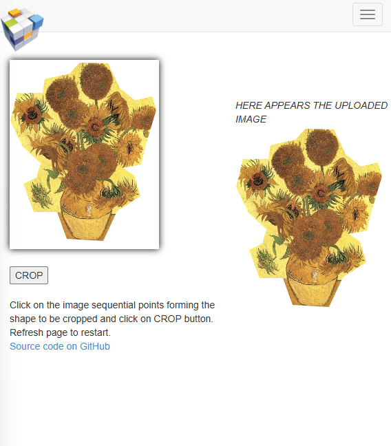

# voidtray
----
[](https://github.com/ellerbrock/open-source-badges/) [](https://opensource.org/licenses/MIT)


<!--  -->


<h2 align="center">____________________</h2>

<h4 align="center">________________________</h4>

---


# Installation
### 
```bash
cd ~
git clone https://github.com/wisehackermonkey/voidtray.git
cd voidtray
conda init powershell

conda create -n voidtray 
conda activate voidtray

conda install -c conda-forge scikit-image -y
python -c "import skimage; print(skimage.__version__)"

conda install -c conda-forge matplotlib -y


conda install -c conda-forge jupyterlab -y
# test jupyter
jupyter lab
```
# visit 
http://localhost:8888/lab


# enter the password on click the link


#sucess!


conda install -c conda-forge ipywidgets -y
partial success


# getting something. but i need a way to denoise


# different


# i think using a background removal tool will get my a huge way farther
conda install -c conda-forge rembg -y

# see how the tape that is white does a great job!


had to change from python 3.13 to 3.11 because rembg doesnt work on latest

conda install -c conda-forge jupyterlab ipywidgets matplotlib -y
 
pip install pillow "rembg[cpu,cli]" # for library + cli


rembg looks promising


# sucess!


# looks great!


# now on a spoon


# got a convex hull working!


# my mouse

# for two objects they are treated as one. need to fix

# works but has some weirness

# need to convert to vector

# kinda working but has edge width problems

# got the line width down


# figured out how to fill in the contours


# need to make line more smooth
# got smoother but issues with blobbyness

changed some settings and got this. which is not bad


still bad output

## im thinking now its the outline to svg causing the issues

hmm maybe not. the edge looks bad

# found a cool algo called 
# Ramer–Douglas–Peucker algorithm
[Ramer–Douglas–Peucker algorithm | EKbana ML Study Group](https://ekbanaml.github.io/remote%20sensing%20and%20satellite%20image%20processing/RDP_algorithm/)


# trying this approach
`pip install rdp`

results wernt that impressive 
and didnt solve my line width issue


# trying another achetcture approach
backend python
front end javascript. with the goal of the javascript and opencv.js to polygon cut out the shapes

pip install flask rembg pillow
python app.py
# got the polygon crop to work

# and the background remobal but the two combained is hard


# semi working crop


# cool wow factor stuff

https://openjscad.xyz/#


# cool color scheme doesnt work for arbitrary shapes

https://maker.js.org/playground/?script=Slot

great polygon crop demo
https://netplayer.gr/crop/




# razterizer
https://github.com/jankovicsandras/imagetracerjs?tab=readme-ov-file#examples
# Summary
### -  *[Installation](#Installation)*
<!-- ### -  *[Deveopment](#For-developers)* -->
<!-- ### -  *[Links](#Links)* -->
### -  *[Contributors](#Contributors)*
### -  *[License](#License)*


<!-- 
--------------
# Screenshots
-  
 

-------------- 
# Development
### 
```bash
```

# Deployment to surge.sh
### 
```bash
bash deploy_to_surge_sh.sh
```

---
# Links
###
-->

--------------
# Contributors

[](https://github.com/wisehackermonkey/voidtray/graphs/contributors)

##### Made with [contributors-img](https://contrib.rocks).

--------------


# License

#### MIT © wisehackermonkey


[](https://opensource.org/licenses/MIT)
```bash
by oran collins
github.com/wisehackermonkey
oranbusiness@gmail.com
20250716
```

#### [More of my Projects](https://github.com/wisehackermonkey/)