# how to image pipeline works.

#  look at pipe.ipynb
todo 
⦁	contour edge offset 3mm
⦁	find a tool for uploading images to your desktop from phone, with browser
- make pipeline
- how to run openscad CLI, or server

# flow of data
- adjust contrast (add instructions for user, dont put hands)
- remove background
- create bit mask
- vectorize (bit mask to svg)
- smooth and simplify the vector path (svg)
- save image with UUID name

options for image process:
- temp file
- in memory file
- actual file with UUID

# how to remove the image's shadows
- my first attempt
i liked the gamma correction the best
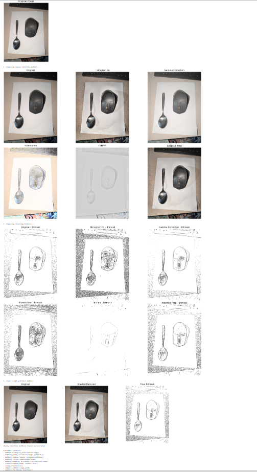
# tried another method, also didnt work
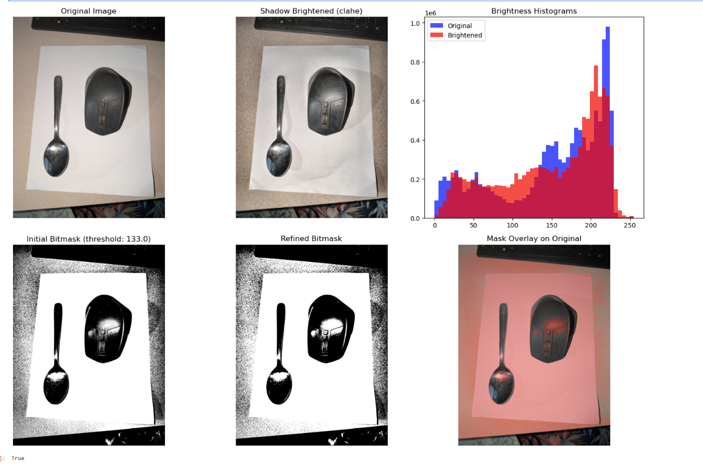
# all those were automated versions

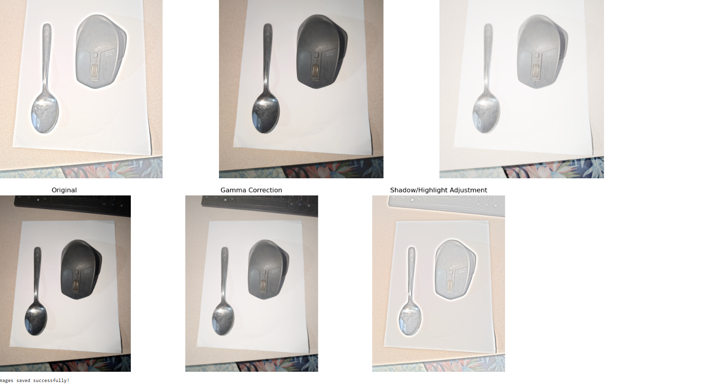
# kinda worked. but i want to adjust the bit mask

# after breaking out into affinty photo , looks like adjusting exposure does the biggest bang for buck at removing shadows
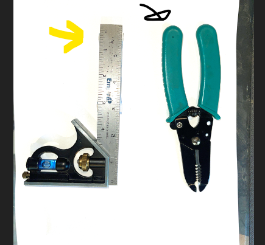
# adjusting the exposer in python works great!
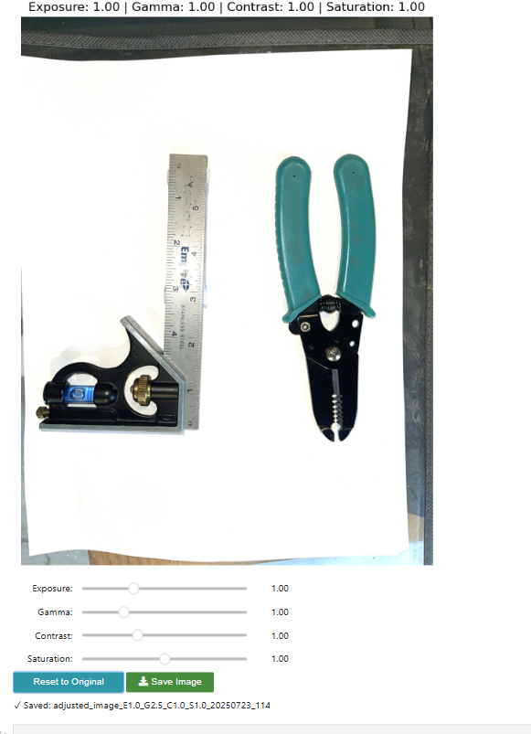
# becomes much better mat, when the gamma is adjusted
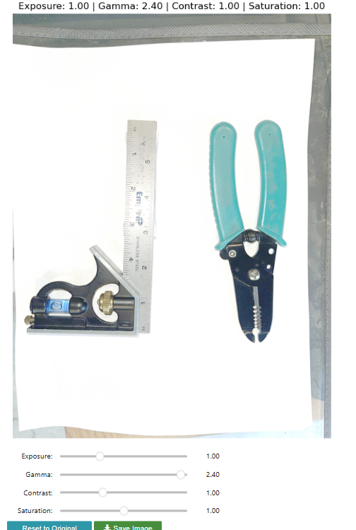

# heres the final output with the better mat
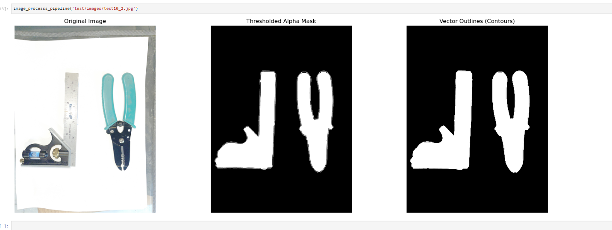

# found out that i wasnt smoothing the binary mask enought, and caused shitty edges
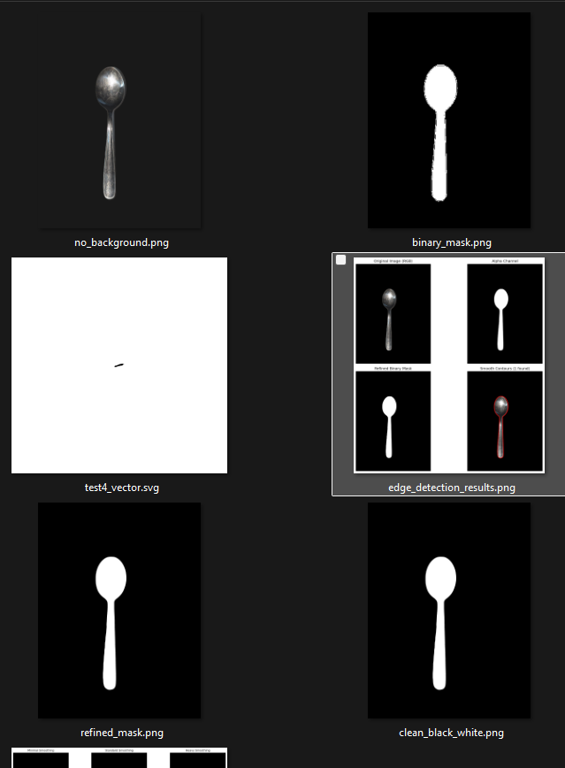

# output looks great
from
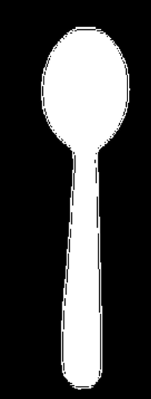
to
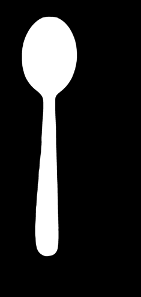

# getting the smoothing for the bitmask working

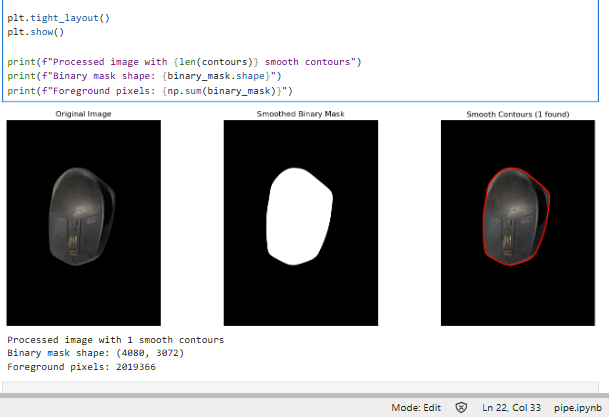

# the binary mask looks great now!
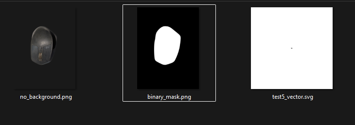
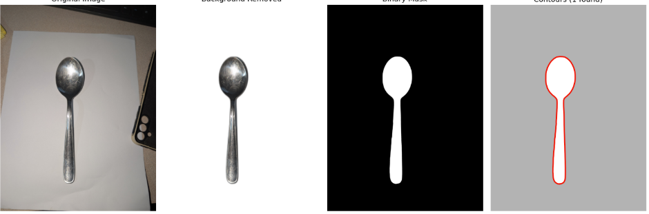
# but the vector output is shit
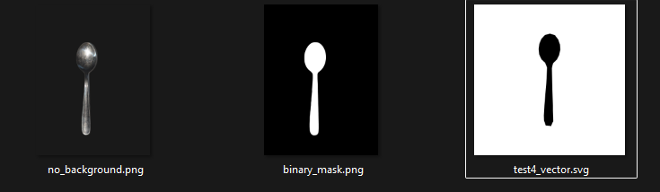
# turns out it was a simple path not being passed issue! omg whyhahah
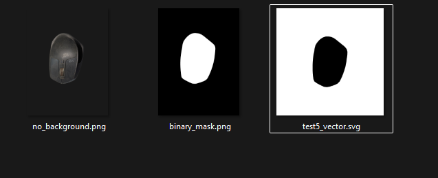
### seems to work with my two example images
# works faily good with openscad!
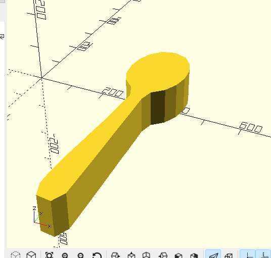

# got the open scad to work from CLI
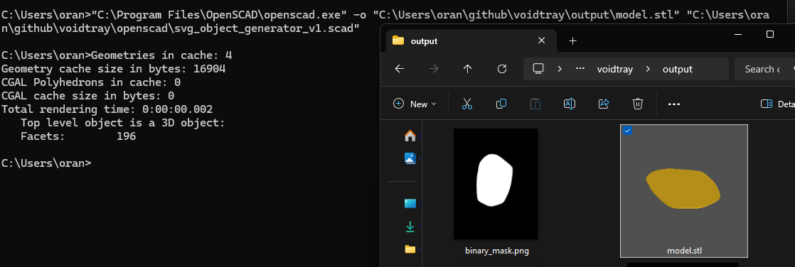

# trying out cadquery for python as a alternative or openscad

`conda install -c conda-forge cadquery`
# got it working in cad  query,
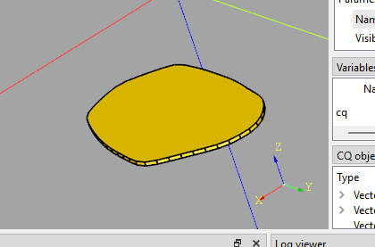

# wow that did 80% of what i wanted! cool. i like that fact that its all python and not mixing
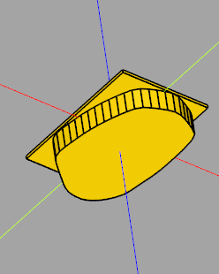
# first 3d model cut from a svg!
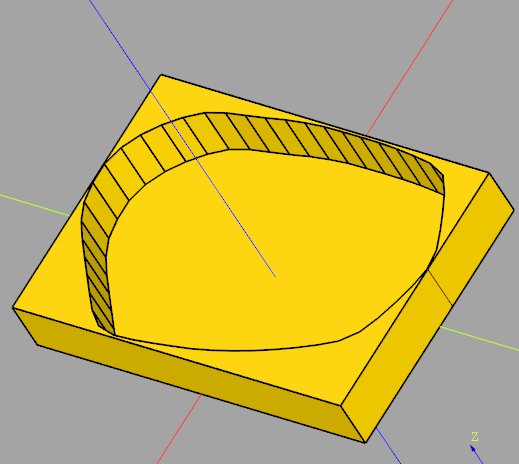
# works with the spoon
but having issues with scaling
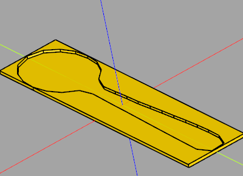

still issues with scale but bettter
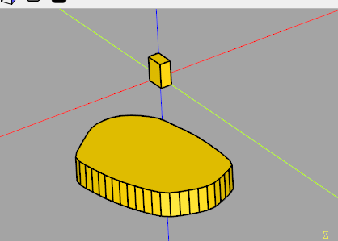

# turns out it was the svg import god that was way harder than expected
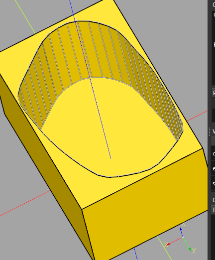

# thats looking pretty good!
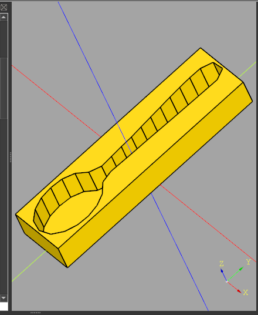
# got the full chain working!
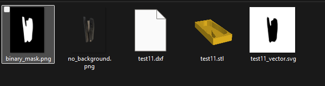
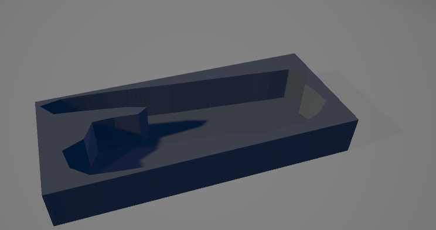

# web ui

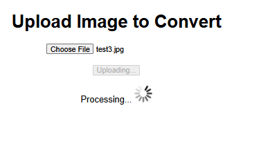

# added a kickass crop interface
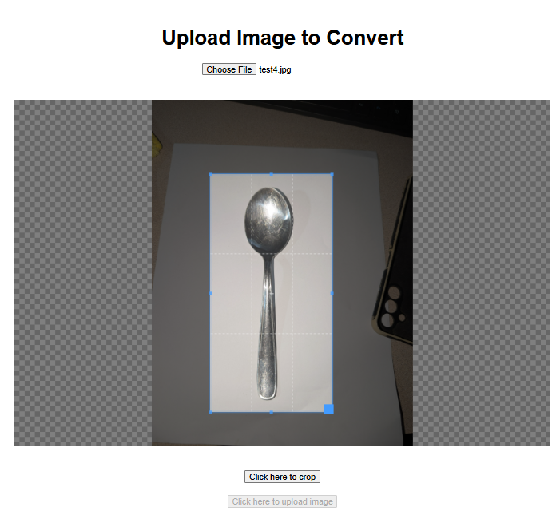

# working on the ui for pixel to mm ratio

# here's the v1
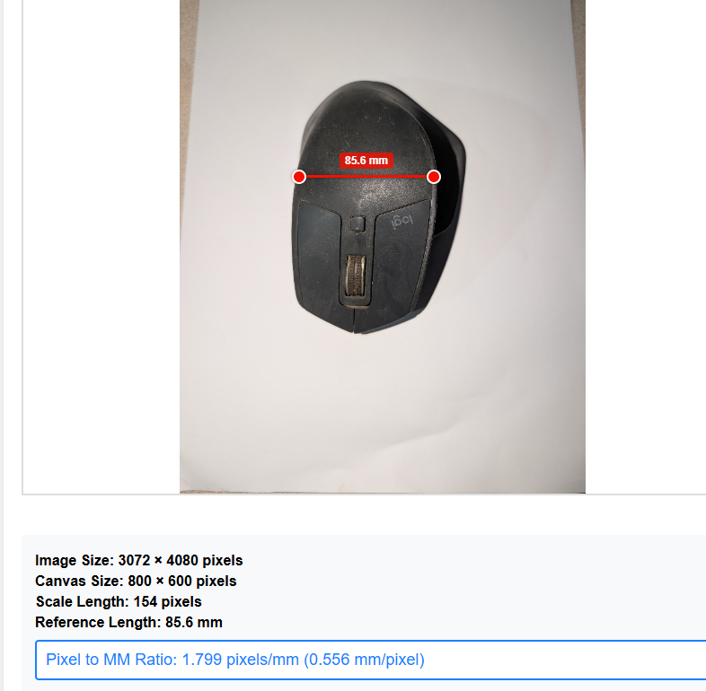

# first try dimentional accuracy

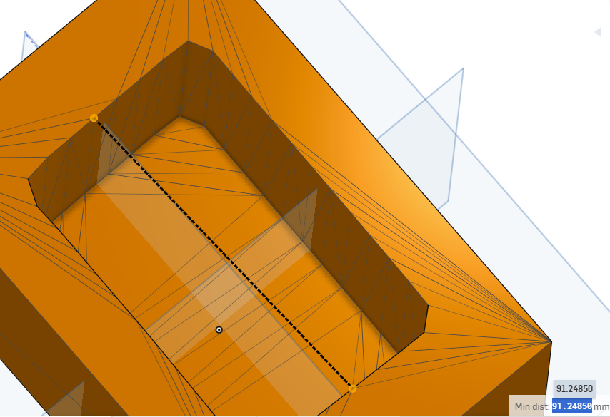
# suppried it wasnt crazy off!
### 91.24mm vs the actual 85.6 mm!

# final inteface
- Remove shadows (gamma)
- Image Exposure (good for removing shadows)
- contrast (sometimes helpful)
- reset to original
- "Process image", "Save locally"